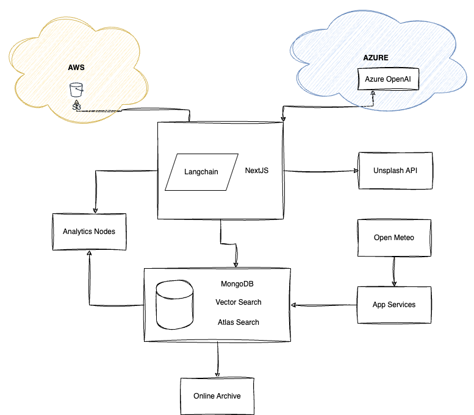

# Details

**Project** : rAInyday
**Team Number** : Number 1
**Team Name** : London
**Demonstration Video** : _Insert link to demonstration video_

# Overview

rAInyday is an AI powered personal finance app. Hook it up to all your transactions / statements / photos and we'll give you recommendations and insights, whatever the weather.

# Justification

_Please explain why you decided to build the application/demonstration for this project. What inspired you? What problems does it solve or how will it make Presales activities easier?_

Personal finance is a topic that everyone can relate to and there are a bunch of apps out there with various functionalities.

The app we've built demonstrates a mix of both solid and creative problem solving / activities that the MongoDB DDP platform can help enable.

_What MongoDB competitive differentiators (developer productivity, resiliency, scalability, etc.) does this demonstration showcase?_

The app demonstrates the flexibility of being able to store and manipulate different data sets, augmenting them with AI powered decisions and insights.

5 people worked for 48hrs on the hack and not once did the platform get in the way.

# Detailed Application Overview



## Data Sets

The app uses 4 main data sets

- personal transaction data. This is real data sourced from one team members Monzo integation (also running in Atlas) gathered over the last 5 years and used with permission.
- Weather data - this comes from OpenMeteo
- PDF Statement data. This was faked for the hack
- Unsplash. This was used to generate images for test

_List all the MongoDB components/products used in your demonstration._

- Atlas
- Timeseries - the weather data is stored in a timeseries collection for efficient querying
- Analytic nodes to isolate the aggregations / search queries
- Vector search - used in categorisation, image suggestion, graph generation
- Online Archive
- App Services
- Search. Powers the search bar on every page

_Describe what you application does and how it works_

- There is a history of transactions in the database that have been categoried according to their description, but there is logic built to use RAG to query an LLM to categorise transactions with missing categories
- Weather data is periodically fetched from OpenMeteo using a scheduled Atlas trigger

User Stories

**Story 1 - Home**

- The home page shows a headline about the user’s spending/saving habits, along with a visual representation of this habit
  - The headline is provided by the LLM, along with a keyword that is then used to get a picture from Unsplash
  - The user can then click on the “Read more” button to see the reason behind it
- Below that, the user has access to see their connected accounts as we’ll as uploading PDF statements

**Story 2 - Statment upload**

- PDF import.

- From the home screen, the user can upload a legacy/exported/scanned bank statement and get automatic import and categorisation via LLM

- A new screen will then appear with the list of transactions that were detected by the LLM

**Story 3 - Categories Charts**

- In the Categories screen, the user can see 2 predefined charts:
  - One that tracks their total spend over time
  - Another one that shows the total spend percentage in each category
    - These use MongoDB aggregations that queries an Analytical Node to not impact the operational workload

**Story 4 - Custom Charts**

- Besides the 2 predefined charts, the user can ask rAIny to create an on demand chart
  - This uses the LLM to create a valid ECharts JSON specification to display the required data.
  - The LLM is provided with context from the Atlas Vector Search using RAG
    - The transactions stored in MongoDB are the actual context and not a text version

**Story 5 - Spending By Category**

- This shows the aggregated spending by category for all time
- LLM provides the classification for the data using Atlas Vector Search
- For any that are currently unclassified, the user can click and the app uses a RAG prompt to ask the LLM to classify the transact

- The weather page shows the weather patterns for the last week and will automatically saved based on the weather data
  The Rainyday savings screen shows you how much money you saved over the last 60 days on a weekly basis
  Using the precipitation data from the weather feed, we save the user £1 per mm of rainfall
  We use LLM to forecast the next 30 days based on the data context coming from Atlas Vector Search on the weather data

**Story 6 - Rainyday savings**

- The Rainyday savings shows you how much money you saved over the last 60 days on a weekly basis
  - Using the precipitation data from the weather feed, we save the user £1 per mm of rainfall
  - We use LLM to forecast the next 30 days based on the data context coming from Atlas Vector Search on the weather data

**Story 7 - Pictures**

- In the Pictures screen the user uploads a photo of their current situation. The rainyday saving app will ask GPT4 (vision) to use the image as context and suggest how the user can save money
- In the example the vision api has understood the price of each bag of sand and suggests choosing the cheaper bag of sand
- The AI will keep things light by returning an amusing summary if appropriate

**Story 8 - Search**

- The search bar is available in all screens
- The user can search for any transaction
- There is an Atlas Search autocomplete index on 3 fields:
  - description
  - category
  - amount
- The user can then click on a result and see the transaction details in a new screen

# Database Structure

Collections

- category_by_description - Maps description to categiory - Used as a vector store to aid categorisation
  - Has a vector search index named vector_index on the description
- images - created on insert
- saving_history - created via aggregations
- statements
- transactions - created by the seed script.
  - Index on ts and category, vector_index on everything, autocomplete index on amount, category and description
- transactions_rt - created by the seed script. Can be used via app services to insert transactions in 'real time' into the transactions collection
- trigger_control - used by the above to control whether or not to insert real time transactions
- unsplash_images - a cache
- weather_history - created by the seeds script - stores 1yr of historical weather data
- weather_ts - populated once an hour via app services calling OpenMeteo
  - Online Archive to archive after 1 day, delete after 1yr

# Roles and Responsibilities

- Peter Fitch - UI
- James Miles - PDF Import
- Carlos Castro - Weather data, chart generation
- Ralph Johnson - Spending Stories, Comparison and Image Saver Insights
- James Osgood - transaction import and categorisation

# Demonstration Script

## Pre-requisites

- MongoDB Atlas Account (API Key)
- Unslash account (API Key)
- Azure OpenAPI endpoint (API Key and config)
- AWS account (AWS Acess Keys)

### Step 1. Run terraform to deploy infrastructure

Create a terraform.tfvars based on the variable.vars definition

Run

```bash
cd backend
terraform init
```

Run

```bash
terraform plan
```

Run

```bash
terraform apply
```

Approve the changes if no errors appear.

### Step 2. Create the .env.local file

Create a new .env.local file in the frontend directory and fill the required configuration as per the .env.local.example file

```bash
cd frontend
cp .env.local.example .end.local
vi .end.local
```

Make sure the configuration is correct as you might have issues in the next steps if it is not.

### Step 3. Seed the data to the database

To seed all the data, run the following commands

```bash
npm install
npm run seed_data
```

This runs all the scripts in the data directory

- create_transactions.mjs
- create_embeddings.mjs
- create_category_by_description.mjs
- savings_history.mjs
- total_savings.mjs
- seed.mjs

### Step 4. Start the web app

Build and start the NextJS app (in the frontend directory)

```bash
npm run build
npm start
```

## Step 5. Open the app in the web browser

Go to [http://localhost:3000](http://localhost:3000) in your web browser.
The web app was designed for mobile, so open the Dev Tools and select a mobile device (we used the iPhone 14 Max )

Watch the video to learn how to demo this app.

_The demonstration script should provide all the information required for another MongoDB SA to deliver your demonstration to a prospect. This should include:_
_step by step instructions on how to give the demonstration_
_key points to emphasize at each point in the demonstration_

- Re-running the seed_data script will reset the database back to the default state
